<!--
_class: lead gaia
_paginate: false
-->
# **企业级计算机硬件杂谈**
### 柳迪潇

  

---
## "服务器" ("Server")

啥是服务器？

TOP500 June 2022 #1
**FRONTIER**

Core(s): 8,730,112
Rmax: 1,102 PFlop/s

https://www.olcf.ornl.gov/frontier/

---
## "服务器" ("Server")

啥是服务器？

**Dell R730**

"Skynet" Network Infra

---
## "服务器" ("Server")

啥是服务器？

**❤ Home ❤ Made ❤**
Supermicro H11 DSi
Epyc 7402

ESXi Server

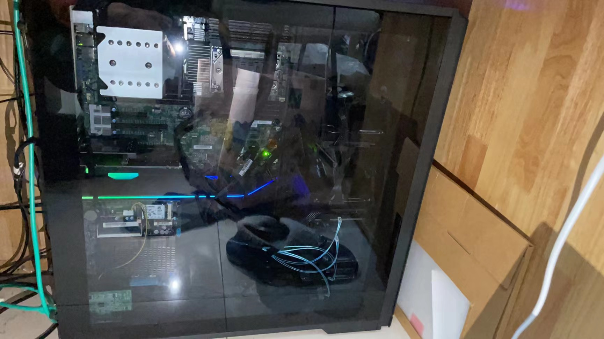

---
## "服务器" ("Server")

啥是服务器？

**RockPi S**
3D Printer on Air
TCP-Serial

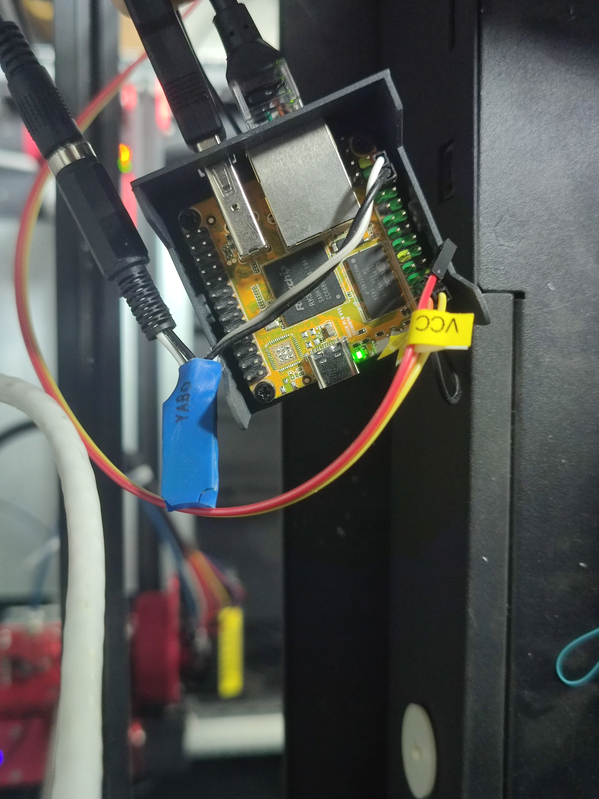

---
## "服务器" ("Server")

啥是服务器？

**Raspberry Pi Zero W**
Lights on/off

Core(s):
Rmax: 0.247 GFlop/s

https://web.eece.maine.edu/~vweaver/group/green_machines.html

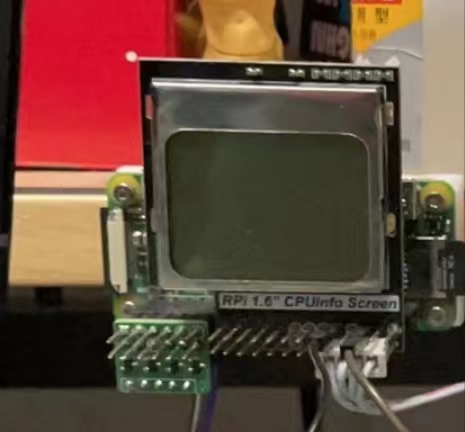

---

### "企业级"

  

- 免工具维护
* 冗余设计
- 热插拔

---

### "起夜级"

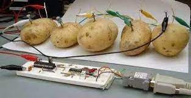

---

## 物理结构

### 分类

 

- 机架式(Rack)
* 塔式(Tower)
- 刀片式(Blade)

---
#### 机架式(Rack)

---
#### 塔式(Tower)

---

#### 刀片式(Blade)

---
## 以 R730 为例

  

#### $\quad$ 风道设计 (Cover)

---
## 以 R730 为例

---
## 组成单元

- 主板 (Motherboard)

* 中央处理器 (CPU)

#### Difference between server and PC CPU

* 频率较低-单核弱
* 核数高、缓存大-多核强
* 总线吞吐速率大

---
##### Intel

---
##### AMD

---
### 内存 (Memory)
  

##### Thx rxgg @王若溪!!!!
---
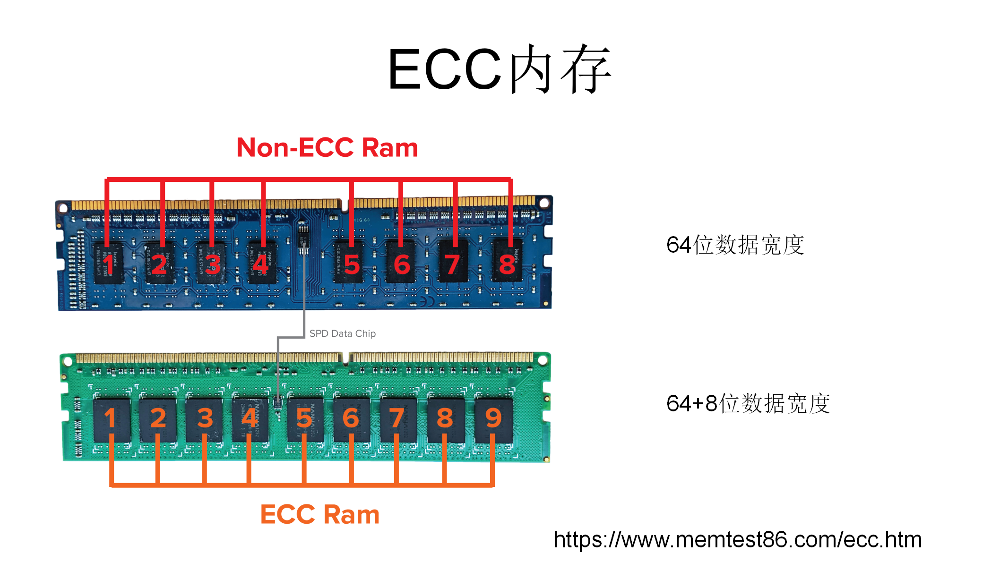

---
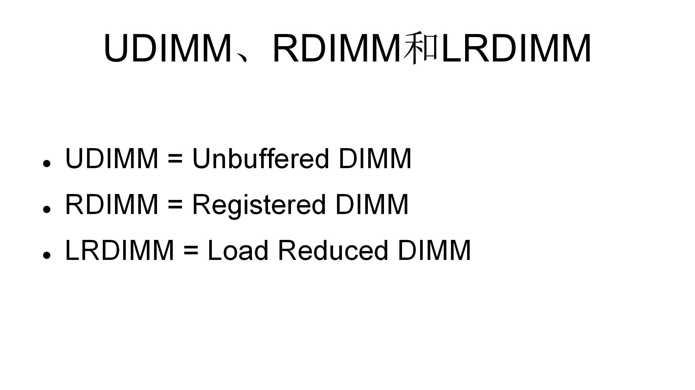

---
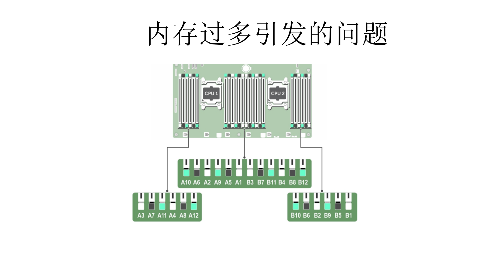

---
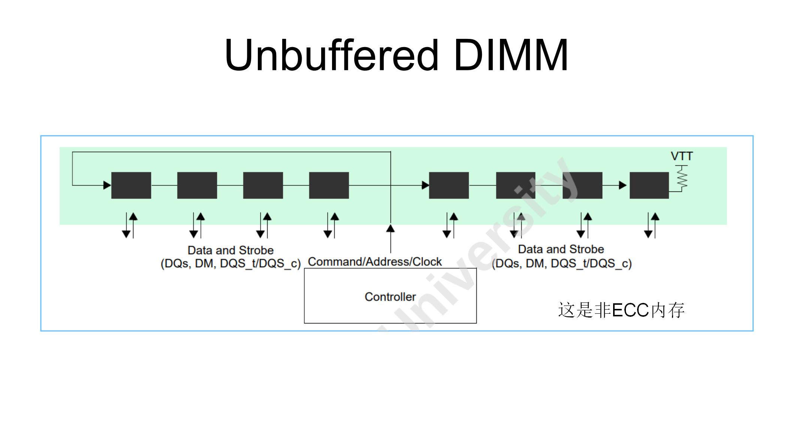

---
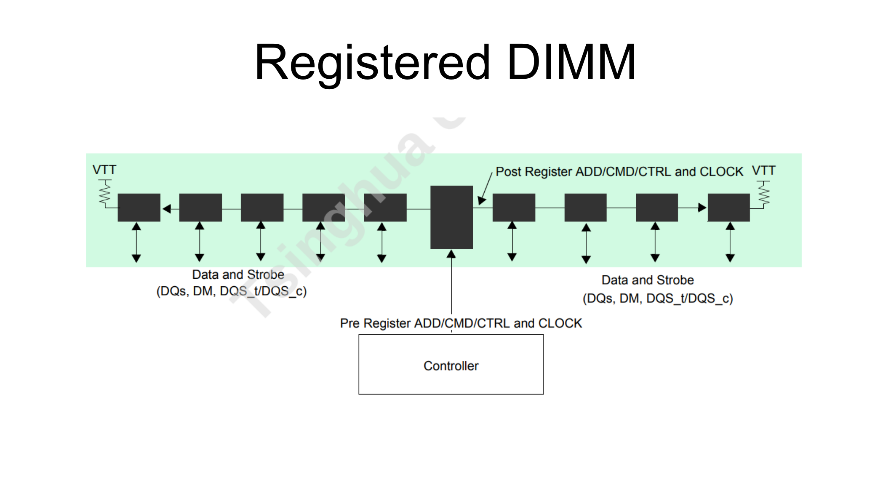

---
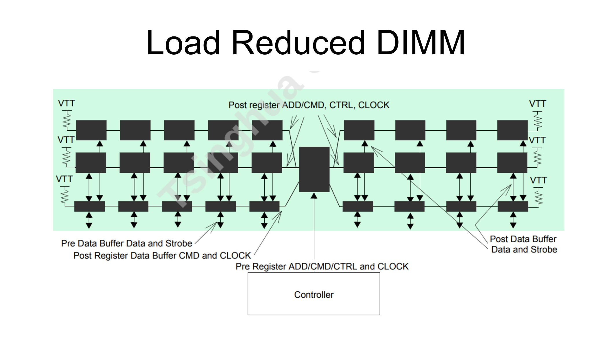

---
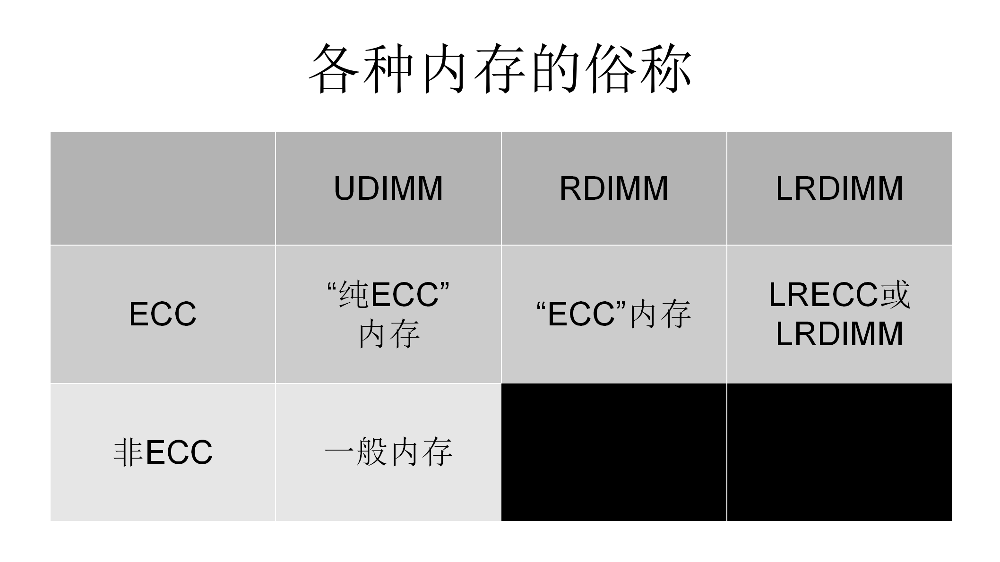

---
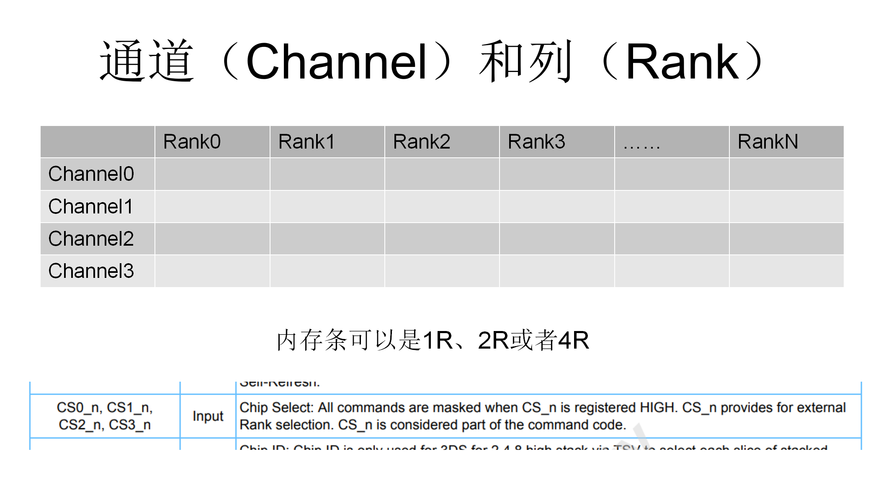

---
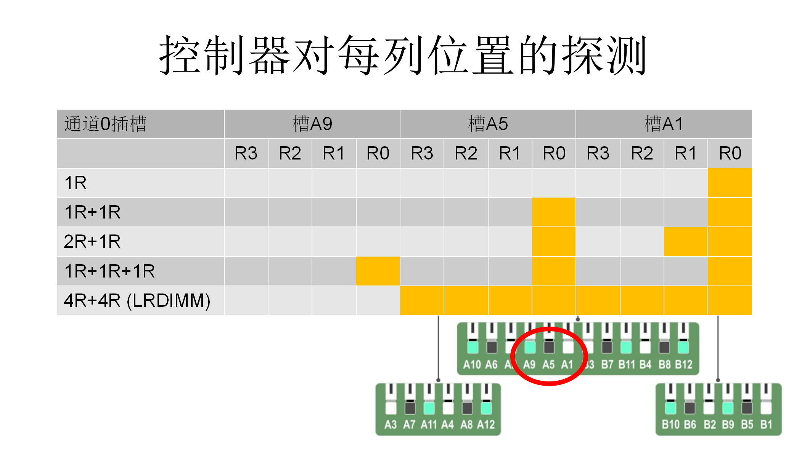

---
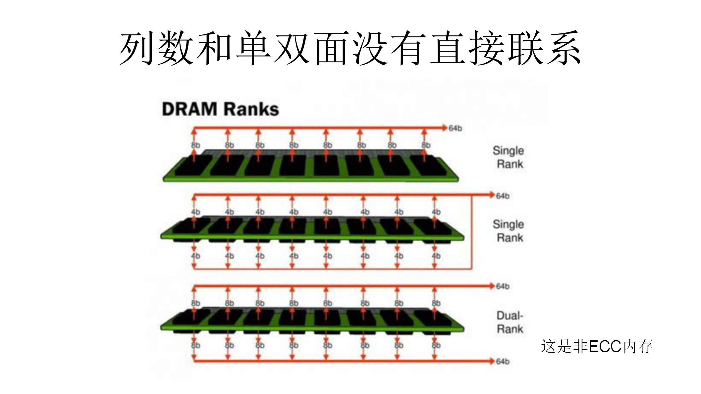

---
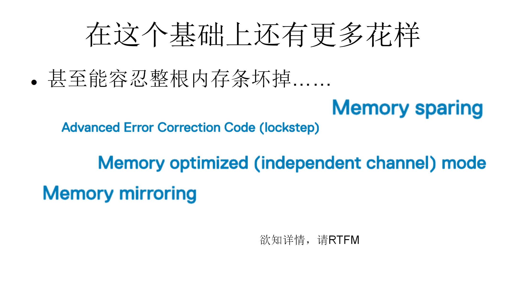

---
### 电源 (Power Supply Unit, PSU)

---
### 存储

#### SAS (Serial Attached SCSI)

接口向下兼容 SATA (Serial AT Attachment, Serial ATA)

---
##### Physica interface

---
#### SAS与SATA接口带宽比较
  

* SAS: 3 Gb/s in 2005, 6 Gb/s in 2009, 12 Gb/s in 2H 2013

- SATA: 1.5 Gb/s in 2003, 3 Gb/s in 2005, 6 Gb/s in 2010 (traditional SATA is not expected to extend beyond 6 Gb/s)

---
#### 为什么SAS更适合应用在服务器和工作站上

* 读写速度
- 价格
* 智能技术
- 外围硬件生态

---

##### jmicron 七宗罪

他家的usb sata，pcie sata，sata raid控制器，sata port multiplexer只做到了“能用”的水平，但是价格低所以大家用的硬盘盒、易驱线里面基本都是这些

##### Bug 大赏

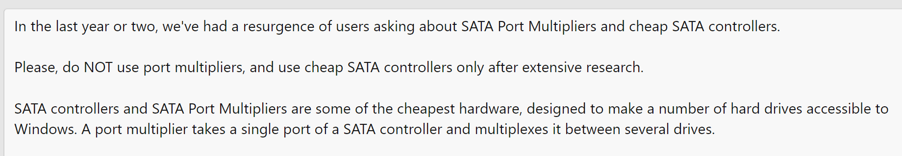

[Multiply your problems with SATA Port Multipliers and cheap SATA controllers | TrueNAS Community](https://www.truenas.com/community/threads/multiply-your-problems-with-sata-port-multipliers-and-cheap-sata-controllers.96631/)

---
#### RAID
##### RAID controllers

---
#### SAS expanders

---
#### M.2, U.2 & NVMe

##### M.2

---
#### M.2, U.2 & NVMe
##### U.2

---
#### M.2, U.2 & NVMe
##### NVMe (Non-Volatile Memory Express)

---
#### 智能平台管理接口 (Intelligent Platform Management Interface, IPMI)

原本是一种Intel架构的企业系统的周边设备所采用的一种工业标准。
* 1998年Intel、DELL、HP及NEC共同提出IPMI规格，可以透过网络远程控制温度、电压。

* 2001年IPMI从1.0更新至1.5，新增PCI Management Bus等功能。

* 2004年Intel发表了IPMI 2.0的规格，能够向下兼容IPMI 1.0及1.5的规格。新增了Console Redirection，并可以通过Port、Modem以及Lan远程管理服务器，并加强了安全、VLAN 和刀片服务器的支持性。

---
#### 特性
 

* IPMI独立于操作系统外自行运作，并容许管理者即使在缺少操作系统或系统管理软件、或受监控的系统关机但有接电源的情况下仍能远程管理系统。IPMI也能在操作系统启动后活动，与系统管理功能一并使用时还能提供加强功能，IPMI只定义架构和接口格式成为标准，详细实现可能会有所差异。

---
#### 组成

* IPMI包含了一个以基板管理控制器(BMC)为主的控制器和其他分布在不同系统模块（被称为“卫星”控制器）的管理控制器

---
#### 组成

* 同一设备内的卫星控制器通过称为智能平台管理总线/桥 (IPMB) 的系统接口连接到 BMC，这是 I²C 的一个增强实施。 BMC 通过智能平台管理控制器总线/桥(IPMC)连接到卫星控制器或另一个设备中的另一个 BMC。它可以通过远程管理控制协议 (RMCP) 进行管理。

---
##### BMC

---

## 我们来玩一玩 IPMI

---

## RTFM

